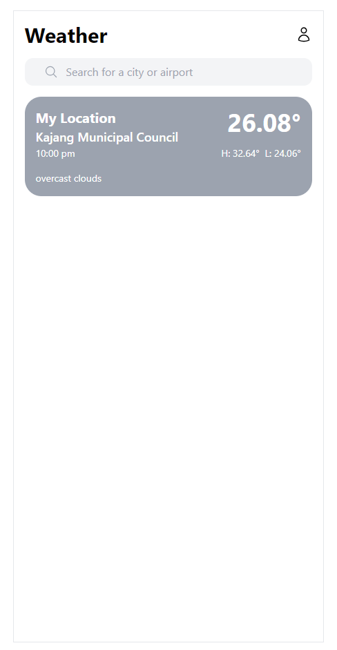

# **Tawk.to Assessment**

## **Weather App**

### **Overview**

This Assessment project is a Vue 3 SPA application that provides weather information using the OpenWeather API and OpenStreetMap.

---

### **Tech Stack**

- **Front-End**: Vue 3, TypeScript, Tailwind CSS
- **State Management**: Pinia
- **Validation**: Vuelidate
- **Icons**: Heroicons
- **Utilities**: VueUse
- **Networking**: Axios
- **Offline Support**: idb

---

### **Installation and Setup**

> ⚠️ **Enable Location**  
> On the first load of the application, a popup will request permission to access your current location.  
> **Please enable location services** to allow the app to display accurate weather data for your current location.

1. **Clone the repository**:
    ```sh
    git clone https://github.com/nabs32595/tawk-assesment.git
    cd tawk-assessment
    ```

2. **Set up environment variables**:
    - Copy the provided `.env.example` file and rename it to `.env`.
    - Fill in the necessary values for the environment variables.

   Example:
    ```sh
    cp .env.example .env
    ```

3. **Install dependencies**:
    ```sh
    npm install
    ```

4. **Start the development server**:
    ```sh
    npm run dev
    ```

5. **Examples of Cities Tested with the Weather API**:
   - Milan
   - New York
   - Kuantan
   - Sibu
   - Mumbai (Airport)
   - Kuala Lumpur International Airport (KLIA)

---

### **Live Demo**

Access the live version of the application here: [Live Demo](https://nabilweather.netlify.app/)

---
### **Example Screenshots**

#### **1. Location Permission**

> ⚠️ **Enable Location**  
> On the first load of the application, a popup will request permission to access your current location.  
> **Please enable location services** to allow the app to display accurate weather data for your current location.
> 


#### **2. Weather Dashboard**


#### **3. City List**


#### **4. Weather Detail**


#### **5. Profile Page**


#### **6. Profile Validation**


---
### **Future Improvements**

Due to limited time, im only available to work on weekends for this assessment, the following enhancements are my plan for future:

1. **Integrate with a Back-End Service**:  
   Add a back-end service to store and manage user profile.

2. **Implement Unit Tests**:  
   Introduce unit testing to ensure the reliability of components.

3. **Enhance User Flow Testing**:  
   Conduct more user flow testing.

4. **bug fixes**:  
   Fix bugs and improve the user experience.

--- 